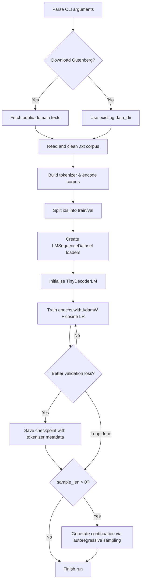

# Custom Transformer Trainer

`train_custom_transformer.py` is a single-file PyTorch script that walks through training a compact decoder-only language model from scratch. It bundles everything—tokenisation, data loading, model definition, training loop, and sampling—so you can experiment with GPT-style architectures without relying on large frameworks.

## Features
- Character- or byte-level tokenizer implemented in pure Python.
- Optional download of classic Project Gutenberg texts for quick experiments.
- Decoder-only Transformer with sinusoidal positional encodings, RMSNorm, multi-head causal self-attention, and GEGLU feed-forward blocks.
- Flexible CLI for tailoring model width/depth, training schedule, and sampling strategy.
- Checkpoint writer that persists the best validation run together with tokenizer metadata.
- Lightweight text generation helper for temperature or top-k sampling.

## Requirements
- Python 3.9+
- PyTorch (CPU or CUDA build)
- `requests` (only if you plan to use `--download_gutenberg`)

To reproduce the development environment you can install the project dependencies with pip:

```bash
python -m venv .venv
source .venv/bin/activate
pip install -r requirements.txt
```

## Data Workflow
1. Point `--data_dir` at a folder of `.txt` files. Each file is loaded, lightly stripped of Gutenberg headers/footers, and concatenated.
2. Choose `--vocab char` to build a character vocabulary from the corpus, or keep the default `byte` to operate on raw UTF-8 bytes with a fixed vocabulary of 256 tokens.
3. The encoded token stream is split into training/validation partitions (default 90/10) and fed to `LMSequenceDataset`, which produces overlapping or non-overlapping sequences depending on `--stride`.

If you need a seed dataset, run with `--download_gutenberg` and the script will fetch a few small public-domain novels into your data directory.



## Quick Start
```bash
python train_custom_transformer.py \
  --data_dir ./downloaded_data \
  --download_gutenberg \
  --context_len 256 \
  --epochs 2 \
  --batch_size 32 \
  --sample_len 200
```

During training the script reports bits-per-character (BPC) for both splits, applies AdamW with cosine annealing, clips gradients, and saves the best checkpoint to `--out_dir` (default `./checkpoints/model.pt`).

## Command-Line Arguments

| Group | Flag | Description | Default |
| --- | --- | --- | --- |
| General | `--data_dir` | Directory of plaintext files | `./data` |
|  | `--out_dir` | Directory to store checkpoints | `./checkpoints` |
|  | `--download_gutenberg` | Download a small Gutenberg bundle | `False` |
|  | `--cpu` | Force CPU even if CUDA is present | `False` |
| Model | `--dim` | Embedding/hidden dimension | `256` |
|  | `--depth` | Number of decoder blocks | `6` |
|  | `--heads` | Attention heads per block | `8` |
|  | `--context_len` | Maximum sequence length | `256` |
|  | `--dropout` | Dropout applied in attention/FFN | `0.0` |
| Training | `--epochs` | Training epochs | `2` |
|  | `--batch_size` | Sequences per step | `32` |
|  | `--lr` | AdamW learning rate | `3e-4` |
|  | `--weight_decay` | AdamW weight decay | `0.01` |
|  | `--grad_clip` | Global gradient norm clip | `1.0` |
|  | `--stride` | Step size between sequence windows | `context_len` |
| Sampling | `--sample_len` | Tokens to generate after training | `200` |
|  | `--temperature` | Softmax temperature during sampling | `1.0` |
|  | `--top_k` | Optional top-k truncation | `0` (disabled) |
| Tokenizer | `--vocab` | `char` (learned) or `byte` (fixed) vocab | `byte` |

## Model Architecture
- **Embedding**: token lookup plus additive sinusoidal positional encodings.
- **Decoder blocks**: each block applies RMSNorm, multi-head causal self-attention (leveraging PyTorch's fused scaled dot-product API), another RMSNorm, and a GEGLU feed-forward network with dropout.
- **Inference**: causal mask is pre-built for the configured context length and reused to reduce overhead.
- **Output head**: linear projection tied to the embedding dimension for next-token logits.

## Sampling
When `--sample_len > 0`, training finishes with a short auto-regressive generation pass starting from the prompt `"The"`. Use `--temperature` to adjust randomness and `--top_k` to limit the candidate pool. Modify `start` inside the script for different prompts.

## Extending the Script
- Replace `CharTokenizer` with a subword/BPE tokenizer for larger vocabularies.
- Swap in a different positional encoding (e.g., rotary) by editing `SinusoidalPositionalEncoding`.
- Plug in custom datasets by pre-processing to the token ID list expected by `LMSequenceDataset`.
- Experiment with optimizers or schedulers by tweaking the `train` function.

## Troubleshooting
- **`requests` import fails**: install it or omit `--download_gutenberg`.
- **CUDA out of memory**: reduce `--batch_size`, `--dim`, or `--context_len`.
- **Slow training**: start with `--epochs 1`, `--depth 2`, and `--dim 128` to validate your setup before scaling up.

Happy tinkering! Open an issue or tweak the script directly to keep exploring transformer fundamentals.
